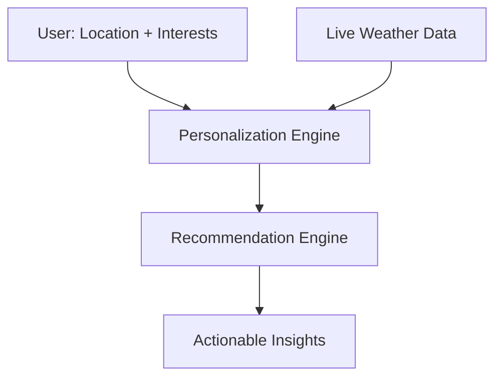

# 🌦️ MAUSAM

## Personalized Weather Intelligence Platform

> **From Weather Data to Personalized Decisions**

Mausam is a personalized weather intelligence platform developed for **Smart India Hackathon 2026** by a student team from **Panjab University, Chandigarh**.

Mausam is designed to go beyond displaying conventional weather information. Instead of simply showing temperature, humidity, rainfall and forecasts, the platform combines **live meteorological data, user location and personal interests** to provide meaningful and contextual weather-based recommendations.

The core idea behind Mausam is simple:

> **Weather information becomes more useful when it is personalized according to the person using it.**

---

## 📑 Table of Contents

1. [Smart India Hackathon 2026](#-smart-india-hackathon-2026)
2. [Problem Statement](#-1-problem-statement)
3. [Proposed Solution](#-2-proposed-solution)
4. [Key Features](#-3-key-features)
5. [How Personalization Works](#-4-how-personalization-works)
6. [System Architecture](#️-5-system-architecture)
7. [What Makes Mausam Different](#-6-what-makes-mausam-different)
8. [Limitations](#️-7-limitations)
9. [Future Scope](#-8-future-scope)
10. [Team](#-team)

---

# 🏆 Smart India Hackathon 2026

|                 |                               |
| --------------- | ----------------------------- |
| **Project**     | Mausam                        |
| **Event**       | Smart India Hackathon 2026    |
| **Institution** | Panjab University, Chandigarh |
| **Institute**   | UIET, Panjab University       |
| **Team Leader** | Parteek                       |
| **Team Member** | Samridhi                      |
| **Team Member** | Rajit                         |
| **Team Member** | Srishti                       |
| **Team Member** | Prashant                      |
| **Team Member** | Aditya                        |
| **Mentor**      | Dr. Sukhvir Singh             |

---

# 📌 1. Problem Statement

Weather data is easily available today through websites, mobile applications and public APIs. However, most weather platforms primarily focus on **displaying meteorological information**.

Users are generally presented with:

- Temperature
- Humidity
- Wind speed
- Rainfall
- Weather conditions
- Weather forecasts

Although this information is useful, it does not always answer the question that matters most to an individual:

> **"What does this weather mean for me?"**

Different people have different requirements from the same weather conditions.

### 🏃 Runner
A runner may want to know whether the current temperature, rain and wind conditions are suitable for outdoor running.

### 🚴 Cyclist
A cyclist may be more concerned about rainfall and wind conditions before planning a ride.

### 📸 Photographer
A photographer may be interested in outdoor weather conditions when planning a photography session.

### ✈️ Traveler
A traveler may need weather information to understand upcoming conditions at a destination.

### 📚 Student
A student may want to determine whether outdoor study or activities are practical.

### 🌾 Agriculture
Agriculture-related users may require weather information for planning outdoor agricultural activities.

Therefore, the challenge is not only to **collect weather data**, but to transform that data into information that is meaningful for a particular user.

---

# 💡 2. Proposed Solution

Mausam proposes a **personalized weather intelligence layer** over conventional weather data.

The platform combines:

```
   LIVE WEATHER DATA
          +
     USER LOCATION
          +
     USER INTERESTS
          ↓
 PERSONALIZATION ENGINE
          ↓
RECOMMENDATION ENGINE
          ↓
 ACTIONABLE INSIGHTS
```

---

# ✨ 3. Key Features

- 📍 **Location-aware weather** — weather information based on the user's location
- 🎯 **Interest-based personalization** — profiles such as Runner, Cyclist, Photographer, Traveler, Student and Agriculture
- 🧠 **Contextual recommendations** — plain-language guidance instead of raw numbers alone
- 📡 **Live meteorological data** — built around live IMD data

---

# 🧠 4. How Personalization Works

1. **Input** – The user provides their location and interests.
2. **Fetch** – Live weather data is retrieved for that location.
3. **Personalize** – The personalization engine interprets the weather according to the user's interests.
4. **Recommend** – The recommendation engine converts the result into clear, actionable insights.

For example, the same rainfall and wind conditions can mean "good to go" for one user and "better to wait" for another, depending on their activity.

---

# 🏗️ 5. System Architecture



---

# 🔍 6. What Makes Mausam Different

Many weather platforms focus on displaying data. Mausam focuses on **meaning**:

- **Interest-first design** — the experience is built around who the user is, not a fixed dashboard.
- **Actionable output** — weather data is translated into decisions and suggestions.
- **Indian context** — built around IMD data for Indian users.

---

# ⚠️ 7. Limitations

- Recommendations are guidance only and are not a substitute for official weather warnings.
- Mausam is a student prototype built for Smart India Hackathon 2026. It is not an official IMD product.

---

# 🔮 8. Future Scope

- 📱 Native mobile application
- 🤖 Machine-learning-based personalization
- 🔔 Push notifications for severe weather
- 🗣️ More regional languages
- 🌾 Deeper agriculture support
- 🌫️ Air quality and UV index integration

---

# 👥 Team

| Name              | Role         |
| ----------------- | ------------ |
| Parteek           | Team Leader  |
| Samridhi          | Team Member  |
| Rajit             | Team Member  |
| Srishti           | Team Member  |
| Prashant          | Team Member  |
| Aditya            | Team Member  |
| Dr. Sukhvir Singh | Mentor       |

*Panjab University, UIET, Chandigarh*

---

<p align="center">Made with ❤️ by Team Mausam · Smart India Hackathon 2026</p>
