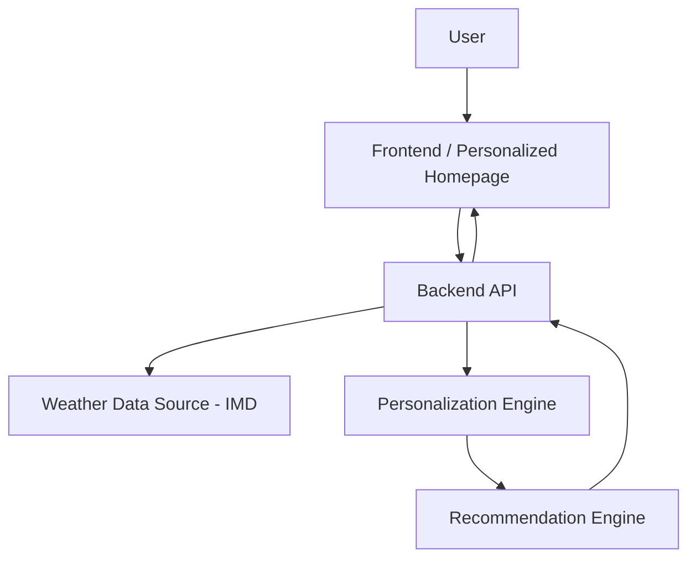

# 🌦️ MAUSAM

## Personalized Weather Intelligence Platform

> **From Weather Data to Personalized Decisions**

Mausam is a personalized weather intelligence platform developed for **Smart India Hackathon 2026** by a student team from **Panjab University, Chandigarh**.

Mausam is designed to go beyond displaying conventional weather information. Instead of simply showing temperature, humidity, rainfall and forecasts, the platform combines **live meteorological data, user location and personal interests** to provide meaningful and contextual weather-based recommendations.

The core idea behind Mausam is simple:

> **Weather information becomes more useful when it is personalized according to the person using it.**

<!-- TODO: Add badges here, e.g. license, tech stack, live demo -->
<!-- [FILL IN] 🔗 Live Demo: <link> | 🎥 Demo Video: <link> -->

---

## 📑 Table of Contents

1. [Smart India Hackathon 2026](#-smart-india-hackathon-2026)
2. [Problem Statement](#-1-problem-statement)
3. [Proposed Solution](#-2-proposed-solution)
4. [Key Features](#-3-key-features)
5. [How Personalization Works](#-4-how-personalization-works)
6. [System Architecture](#️-5-system-architecture)
7. [Tech Stack](#️-6-tech-stack)
8. [Data Sources](#-7-data-sources)
9. [Screenshots](#-8-screenshots)
10. [Getting Started](#-9-getting-started)
11. [Project Structure](#-10-project-structure)
12. [What Makes Mausam Different](#-11-what-makes-mausam-different)
13. [Limitations](#️-12-limitations)
14. [Future Scope](#-13-future-scope)
15. [Team](#-team)
16. [License](#-license)

---

# 🏆 Smart India Hackathon 2026

|                 |                               |
| --------------- | ----------------------------- |
| **Project**     | Mausam                        |
| **Event**       | Smart India Hackathon 2026    |
| **Institution** | Panjab University, Chandigarh |
| **Institute**   | UIET, Panjab University       |
| **Team Leader** | Parteek                       |
| **Team Member** | Samridhi                      |
| **Team Member** | Rajit                         |
| **Team Member** | Srishti                       |
| **Team Member** | Prashant                      |
| **Team Member** | Aditya                        |
| **Mentor**      | Dr. Sukhvir Singh             |

---

# 📌 1. Problem Statement

Weather data is easily available today through websites, mobile applications and public APIs. However, most weather platforms primarily focus on **displaying meteorological information**.

Users are generally presented with:

- Temperature
- Humidity
- Wind speed
- Rainfall
- Weather conditions
- Weather forecasts

Although this information is useful, it does not always answer the question that matters most to an individual:

> **"What does this weather mean for me?"**

Different people have different requirements from the same weather conditions.

### 🏃 Runner
A runner may want to know whether the current temperature, rain and wind conditions are suitable for outdoor running.

### 🚴 Cyclist
A cyclist may be more concerned about rainfall and wind conditions before planning a ride.

### 📸 Photographer
A photographer may be interested in outdoor weather conditions when planning a photography session.

### ✈️ Traveler
A traveler may need weather information to understand upcoming conditions at a destination.

### 📚 Student
A student may want to determine whether outdoor study or activities are practical.

### 🌾 Agriculture
Agriculture-related users may require weather information for planning outdoor agricultural activities.

Therefore, the challenge is not only to **collect weather data**, but to transform that data into information that is meaningful for a particular user.

---

# 💡 2. Proposed Solution

Mausam proposes a **personalized weather intelligence layer** over conventional weather data.

The platform combines:

```
   LIVE WEATHER DATA
          +
     USER LOCATION
          +
     USER INTERESTS
          ↓
 PERSONALIZATION ENGINE
          ↓
RECOMMENDATION ENGINE
          ↓
 ACTIONABLE INSIGHTS
```

---

# ✨ 3. Key Features

<!-- Keep only the features that are actually implemented. Mark planned ones under Future Scope. -->

- 📍 **Location-aware weather** — automatic or manual location selection
- 🎯 **Interest-based personalization** — choose profiles such as Runner, Cyclist, Photographer, Traveler, Student, Agriculture
- 🧠 **Contextual recommendations** — plain-language guidance such as "Good conditions for a morning run" instead of raw numbers alone
- 📡 **Live meteorological data** — powered by IMD data `[FILL IN: confirm exact source/API]`
- 🔔 **Alerts** `[FILL IN: implemented? Describe or remove]`
- 🌐 **Multi-language support** `[FILL IN: e.g. English/Hindi, or remove]`
- 📱 **Responsive homepage** `[FILL IN: web / mobile / both]`

---

# 🧠 4. How Personalization Works

`[FILL IN: replace with your real logic. Below is a template to adapt.]`

1. **Input** – The user selects location and one or more interests.
2. **Fetch** – Current conditions and forecast are retrieved for that location.
3. **Score** – Each interest has its own rules or weights over weather variables.
4. **Recommend** – The engine turns scores into a verdict and short advice.

### Example: Runner profile

| Factor        | Ideal condition       | Effect on score |
| ------------- | --------------------- | --------------- |
| Temperature   | `[FILL IN]` °C range  | `[FILL IN]`     |
| Rainfall      | None / light          | `[FILL IN]`     |
| Wind speed    | Below `[FILL IN]` km/h| `[FILL IN]`     |
| Humidity      | `[FILL IN]`           | `[FILL IN]`     |
| AQI (if used) | `[FILL IN]`           | `[FILL IN]`     |

**Output example:** `Good for running (Score: 8/10). Best window: 6–8 AM.`

> Is the engine **rule-based**, **weighted scoring**, or **ML-based**? State it clearly here. Judges value clarity on this.

---

# 🏗️ 5. System Architecture



`[FILL IN: update the diagram to match your real components, e.g. database, auth, cache.]`

---

# 🛠️ 6. Tech Stack

| Layer            | Technology        |
| ---------------- | ----------------- |
| Frontend         | `[FILL IN]`       |
| Backend          | `[FILL IN]`       |
| Database         | `[FILL IN / None]`|
| Weather Data     | IMD `[FILL IN: API / dataset]` |
| Hosting          | `[FILL IN]`       |
| Tools            | Git, GitHub `[FILL IN]` |

---

# 📡 7. Data Sources

| Source | Data used | Update frequency | Notes |
| ------ | --------- | ---------------- | ----- |
| IMD `[FILL IN]` | Temperature, humidity, rainfall, wind `[FILL IN]` | `[FILL IN]` | `[FILL IN: access method, API key needed?]` |

> **Disclaimer:** Mausam is a student prototype built for Smart India Hackathon 2026. It is not an official IMD product and is not affiliated with or endorsed by IMD or MoES. `[Keep only if accurate for your project.]`

---

# 🖼️ 8. Screenshots

<!-- Add images to a /screenshots folder, then link them like this: -->

| Home | Personalization | Recommendations |
| ---- | --------------- | --------------- |
|  |  |  |

---

# 🚀 9. Getting Started

### Prerequisites

- `[FILL IN: e.g. Node.js 18+ / Python 3.10+]`
- Git
- `[FILL IN: API keys if required]`

### Installation

```bash
# 1. Clone the repository
git clone https://github.com/Parteek0/MAUSAM-PERSONALIZED-HOMEPAGE-.git
cd MAUSAM-PERSONALIZED-HOMEPAGE-

# 2. Install dependencies
# [FILL IN: e.g. npm install  |  pip install -r requirements.txt]

# 3. Configure environment variables
# [FILL IN: e.g. cp .env.example .env, then add your keys]

# 4. Run the project
# [FILL IN: e.g. npm run dev  |  python app.py]
```

Then open `http://localhost:[FILL IN PORT]` in your browser.

### Environment Variables

| Variable | Description | Required |
| -------- | ----------- | -------- |
| `[FILL IN]` | `[FILL IN]` | `[Yes/No]` |

---

# 📁 10. Project Structure

```
MAUSAM-PERSONALIZED-HOMEPAGE-/
├── [FILL IN: frontend/ or src/]
├── [FILL IN: backend/ or api/]
├── screenshots/
├── README.md
└── [FILL IN: other files]
```

---

# 🔍 11. What Makes Mausam Different

Many weather apps show data, and some offer activity tips. Mausam's focus is:

- **Interest-first design** – the homepage is built around *who the user is*, not a fixed dashboard.
- **Indian context** – built around IMD data and regional needs `[FILL IN: e.g. agriculture, monsoon, heat waves]`.
- **Actionable output** – every data point is translated into a decision or suggestion.
- `[FILL IN: your unique edge, e.g. explainable scores, a specific persona, offline support]`

---

# ⚠️ 12. Limitations

- Recommendations are guidance only and not a substitute for official warnings.
- `[FILL IN: e.g. limited cities, prototype-level accuracy, depends on API availability]`

---

# 🔮 13. Future Scope

- 📱 Native mobile app
- 🤖 ML-based personalization learned from user behaviour
- 🔔 Push notifications for severe weather
- 🗣️ More regional languages
- 🌾 Deeper agriculture support (crop-specific advisories)
- 🌫️ Air quality, UV index and pollen integration
- `[FILL IN: your own ideas]`

---

# 👥 Team

| Name              | Role         |
| ----------------- | ------------ |
| Parteek           | Team Leader  |
| Samridhi          | Team Member  |
| Rajit             | Team Member  |
| Srishti           | Team Member  |
| Prashant          | Team Member  |
| Aditya            | Team Member  |
| Dr. Sukhvir Singh | Mentor       |

*Panjab University, UIET, Chandigarh*

---

# 📄 License

`[FILL IN: e.g. MIT License. Add a LICENSE file to the repo.]`

---

<p align="center">Made with ❤️ by Team Mausam · Smart India Hackathon 2026</p>
